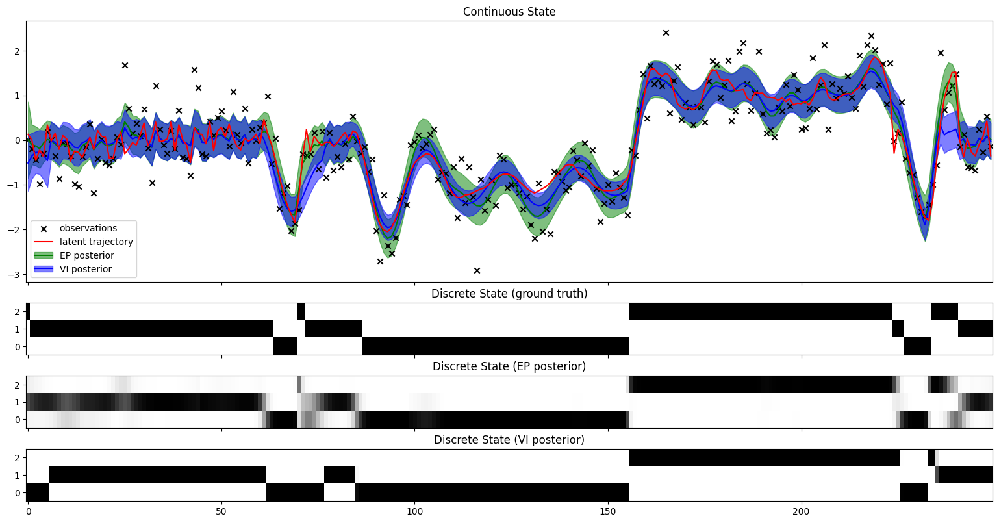

# slds-jax
Inference routines for switching linear dynamical system (SLDS) models in JAX.

## Example usage

```python
model = Slds(A, a0, B, b, b0, C, c, Q, Q0, R)

# structured mean-field VI
inference_state = slds_smf_inference_init(model, observations)
for _ in range(10):
    inference_state = slds_smf_inference_update(inference_state)
posterior = slds_smf_inference_posterior(inference_state)

# get posterior marginals
discrete_marginals = dds_marginals(posterior.discrete_natparams)
continuous_marginals = lds_marginals(posterior.continuous_natparams)

# get posterior marginal summary statistics
discrete_probabilities = vmap(discrete_meanparams)(discrete_marginals[0])
continuous_mean = vmap(gaussian_mean)(continuous_marginals[0])
```
See [this notebook](./notebooks/slds.ipynb) for more complete examples.

## Results
The plot below shows the inferred posteriors using VI and EP on a toy problem, overlaid with the ground truth states and observations. The ground truth model has 3 discrete states governing the continuous dynamics. VI tends to be overconfident in its inference even when it is wrong, whereas EP typically has better calibrated uncertainties. The flipside of this is that EP can be very unstable, requiring significant damping, and even then may diverge. VI on the other hand is guaranteed to converge, and typically does so in a small number of iterations.



## What's here
* Structured mean-field variational inference (VI) [1]
* Expectation propagation (EP) [2,3]

## What's missing
1. parameter learning
2. double-loop EP [3]
3. expectation correction [4]
4. block gibbs sampling
5. ...

## References
[1] Zoubin Ghahramani and Geoffrey Hinton. _Variational Learning for Switching State-Space Models_. Neural computation (2000) \
[2] Tom Minka. _A family of algorithms for approximate Bayesian inference_. PhD thesis, MIT (2001) \
[3] Tom Heskes and Onno Zoeter. _Expectation propagation for approximate inference in dynamic bayesian networks_. UAI (2002) \
[4] David Barber. _Expectation Correction for Smoothed Inference in Switching Linear Dynamical Systems_. Journal of Machine Learning Research (2006)

